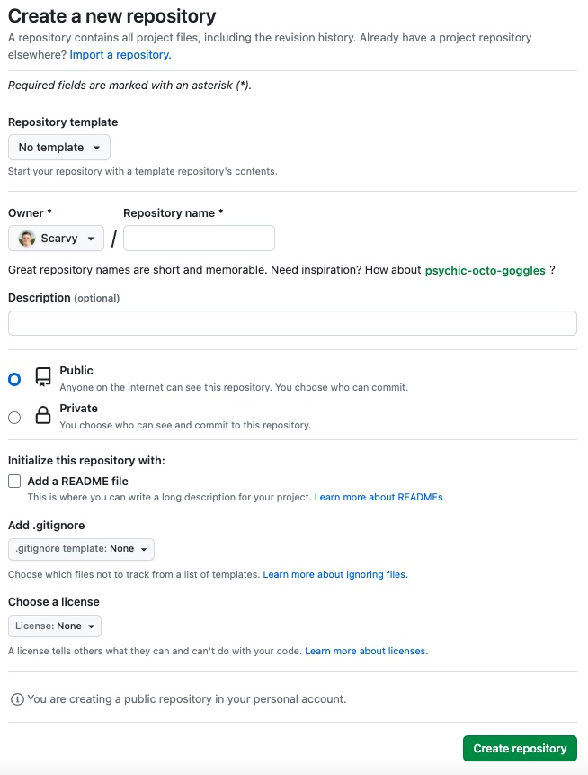

# Building a static website using Pelican

## Intro

If you're looking to create a personal blog or website, I found [Pelican](https://getpelican.com/) is an excellent option for generating static web pages. Pelican is a Python-based static site generator that is easy to use and allows you to create content in Markdown or reStructuredText format.

<!-- more -->

To host my website, GitHub has a service called [GitHub Pages](https://pages.github.com/) that lets users host personal websites for free!

In this guide, I'll walk you through the steps to build a website using Pelican and Github Pages.

## Prerequisites

Before we get started, you'll need the following:

1. [Python 3.x](https://www.python.org/) installed on your computer
2. A Github [account](https://github.com/)
3. [Git](https://git-scm.com/) installed on your computer

## Step 1: Create a New Pelican Project

To create a new Pelican project, I recommend creating a virtual environment.

I use [pyenv](https://github.com/pyenv/pyenv). Open a terminal window and run the following command:

``` bash
pyenv virtualenv <python_version> <virtualenv_name>
pyenv activate <virtualenv_name>
```

Example:

``` bash
pyenv virtualenv 3.9.15 myenv
pyenv activate myenv
```

Next, create a new project directory and navigate to that directory with these commands:

``` bash
(myenv) $ mkdir project_name
(myenv) $ cd project_name
```

Once you are in the project folder, run the following commands:

``` bash
(myenv) ./project_name $ pip install pelican
(myenv) ./project_name $ pelican-quickstart
```

After entering `pelican-quickstart` the terminal will ask you a series of questions about how you want to set up your new Pelican project. Select the "GitHub Pages" option when asked about deployment.

The content directory should look like this after running the `pelican-quickstart` command:

``` bash
(myenv) ./project_name $ tree
.
├── content
├── Makefile
├── pelicanconf.py
└── publishconf.py

Three directories, five files
```

In this example, we can see the directory structure of the Pelican project, which includes the content directory where you can place your Markdown and reStructuredText documents, as well as any other content such as images, PDFs, and more. The project includes a `Makefile,` `pelicanconf.py,` and `publishconf.py` file.

- `Makefile` provides pre-built bash commands to build or deploy your website.
- `pelicanconf.py` configure the site's settings during the development phase
- `publishconf.py` used for the production phase

## Step 2: Create and Customize Your Content

With your new Pelican project, you can create and customize your content in Markdown or reStructuredText format. You can add new pages, blog posts, and custom templates to make your site unique.

(I used the Papyrus theme that you can download [here.](https://aleylara.github.io/Papyrus/installation.html) Follow their instructions on how to set up the theme.)

## Step 3: Build Your Site

To build your site, run the following command in your terminal:

``` bash
(myenv) ~/project_name $ pelican content
```

The command will generate your static web pages in the output directory.

## Step 4: Create a GitHub Repository

Next, you'll need to create a new repository on GitHub to host your Pelican site. Go to your Github account and create a new repository with the name `<username>`.github.io, where `<username>` is your Github username.



## Step 5: Deploy Your Site to Github Pages

A Makefile is created in the project's root directory with pre-built bash commands to build or deploy your website.

To deploy your Pelican site to Github Pages, change the `GITHUB_PAGES_BRANCH` constant in the Makefile to *gh-pages*.

Next, run the following commands in your terminal:

``` bash
(myenv) ./project_name $ make github
```

This command will generate your site and push it to the gh-pages branch of your GitHub repository.

Next, navigate to your GitHub repo, and under the Settings tab, select the Pages menu. Under the Build and Deployment section, change the Branch setting to *gh-pages*.

To check your website is deployed, go under the Actions tab and look for a green checkmark in the workflow that runs the status table. If so, your site should now be live at [https://username.github.io/.](https://username.github.io)

## Conclusion

Building a Pelican static blog generator page and hosting it on Github Pages is a great way to create a personal blog or website quickly and easily. With Pelican's simplicity and Github Pages' free hosting, you can get your site up and running quickly.

For more information on using Pelican and Github Pages, check out the following resources:

## External Links

- [Pelican documentation](https://docs.getpelican.com/en/stable/)
- [Github Pages documentation](https://docs.github.com/en/pages)
