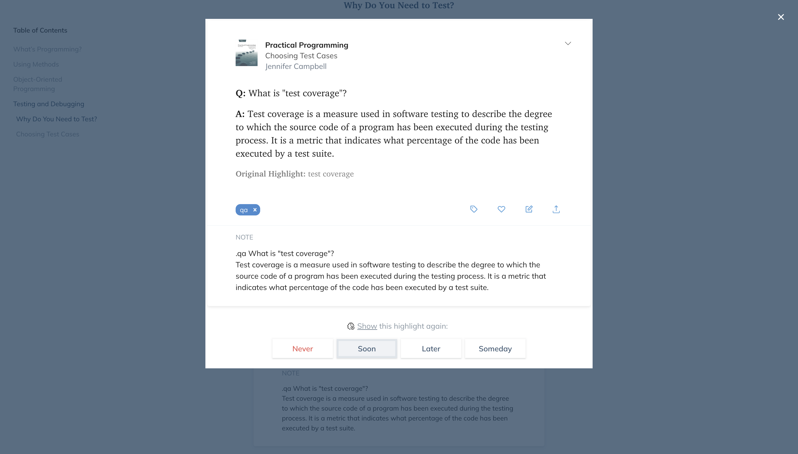
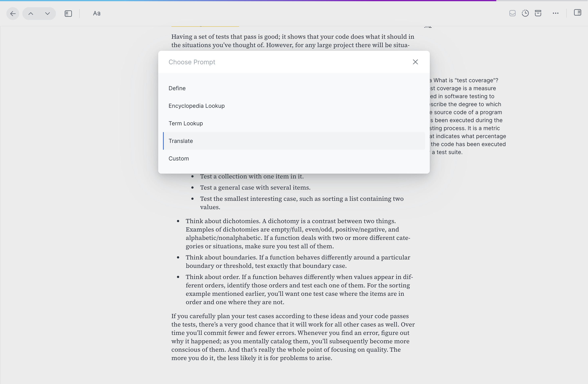
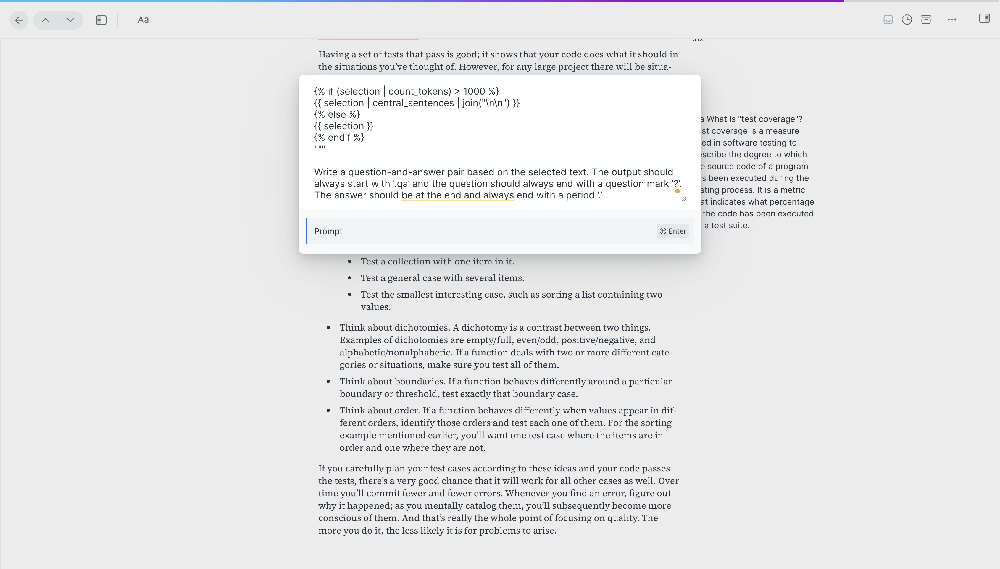
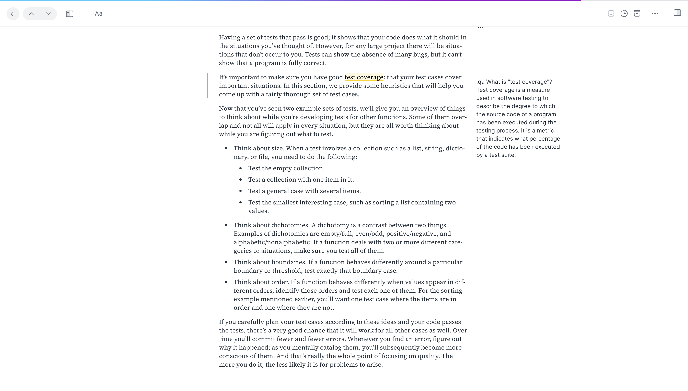
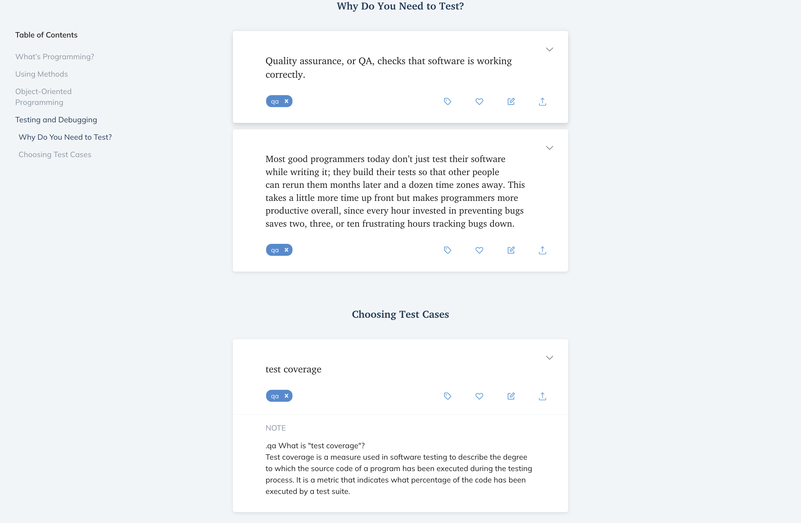
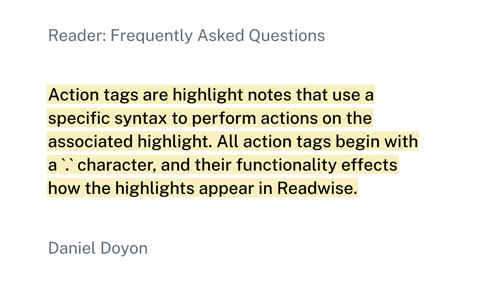
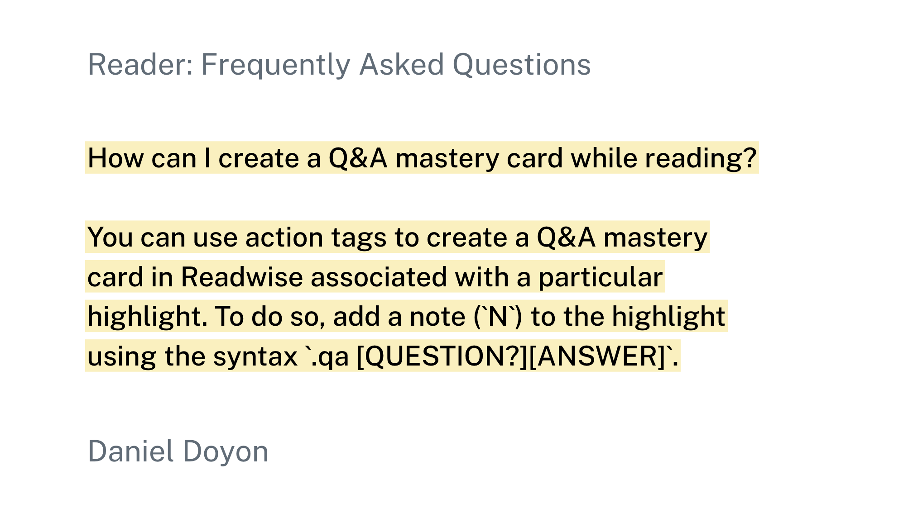

I learned how to automatically create Q&A flashcards (aka *Q&A Mastery* cards) in Readwise using Reader's *Ghostreader* feature.

<!-- more -->

The only thing you need to do is open any document in Reader, open *Ghostreader*, highlight a word, sentence, or paragrpah, and run this prompt:

```text
Below is text from {{ document.title }}:

"""

{{ selection | central_sentences | join("\n\n") }}

{{ selection }}

"""

Write a question-and-answer pair based on the selected text. 
The output should always start with '.qa’ and the question should always end with a question mark ‘?’. 
The answer should be at the end and always end with a period ‘.’
```

Watch as it creates a new note that automatically generates a new flashcard in Readwise.



That's it 🎉!

## Step-by-step

1. Open *Ghostreader* menu and select "Custom":
2. Paste prompt (see above) into the textbox and hit `command + Enter`: 
3. You should see the *Ghostreader* icon pop-up, a note will be created with the AI's response.: 
4. Go to *Readwise* and you should see new *Q&A Mastery* card!: 

## The Secret Sauce

The key is the prompt the model to use Readwise's *Action Tags*.



To create a *Q&A Mastery* card you need to add a note starting with `'.qa'` and the questions needs to end in a question mark `'?'`. Readwise will identify this a new card and automatically create it on its next sync.



## Conclusion

Readwise + Reader is a powerful reading workflow system making it easy to ["capture, review, and integrate"](https://blog.readwise.io/reading-workflow-part-1/) what you read. Now, with this quick trick, you can utilize *Ghostreader* to create *Mastery* cards in Readwise effortlessly.

Try it out yourself!

## Sources

* [How to Actually Use What You Read with Readwise: Part 1](https://blog.readwise.io/reading-workflow-part-1/)
* [The Next Chapter of Readwise: Our Own Reading App](https://blog.readwise.io/readwise-reading-app/)
* [Reader FAQ](https://blog.readwise.io/p/f8c0f71c-fe5f-4025-af57-f9f65c53fed7/)
* [Readwise Inline Tags](https://dylan-garrett.com/blog/readwise-inline-tags/#fn:5)
* [How to Tag Your Highlights While You Read](https://blog.readwise.io/tag-your-highlights-while-you-read/)
